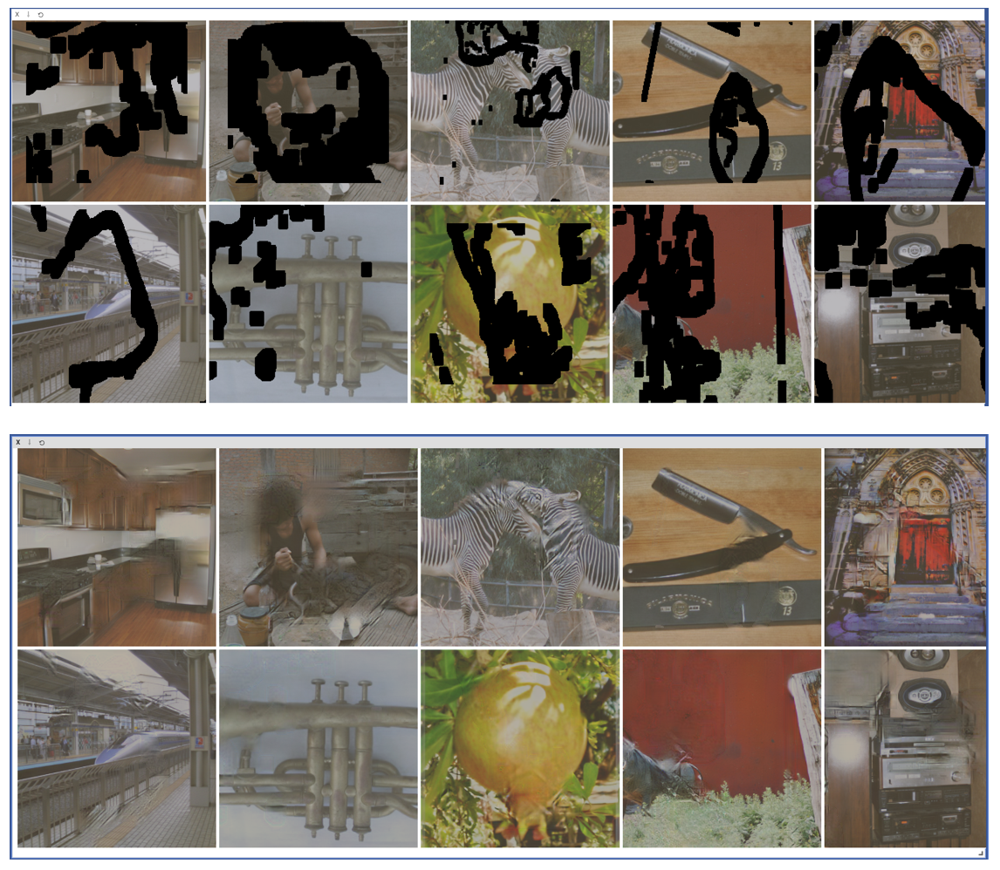
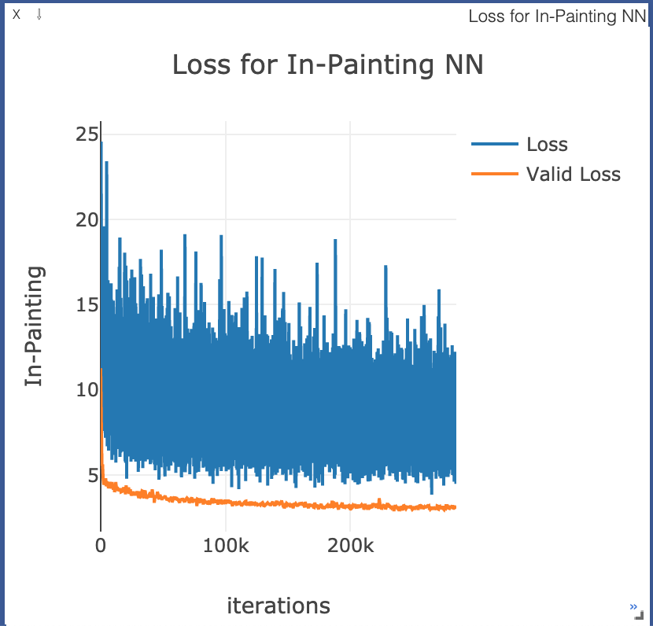

# PyTorch Implementation of Image Inpainting for Irregular Holes Using Partial Convolutions, Liu et al.

This is a PyTorch implementation of the 2018 paper Image Inpainting for Irregular Holes Using Partial Convolutions, Liu et al. published by NVIDIA. This repository reproduces the NVIDIA paper as closely as possible from the paper description, using most of the the same hyper-parameters.

In particular, this repository uses the official implementation of the Partial Convolution operation from NVIDIA (https://github.com/NVIDIA/partialconv), reproduced in the partialconv2d.py file. All other code is original except where documented. 



# Usage

To train the script, simply run `python train.py`. To resume from the pre-trained parameters in the `saved` directory, use `python train.py --resume`. A variety of command-line arguments is available in the `train.py` script. 

The most common training command will likely be

```bash
python train.py
  --datadir [train data directory]
  --validdir [validation data directory]
  --maskdir [mask directory]
```

Many other options can be viewed by running `python train.py -h`. You can do the standard fine tuning step described in the original paper with the `-freeze_bn` option.

# Demo

To actually use the pre-trained weights in a web browser, run the `server/run.sh` script, which will launch a simple flask server and front-end hosted at port `8020` (can be changed in the `run.sh` script). Open `localhost:8020` to experiment on some simple images with pre-trained weights.

Pretrained weights can be downloaded from https://drive.google.com/file/d/1Xbhh1H9CwDjVpsuVldxbWC9UGMelGlCA/view?usp=sharing. This should be placed in the `saved` directory.


# Training Details

This implementation copied the paper as closely as possible, except for a few small changes. The images used were 256x256 instead of 512x512, and the pretrained weights provided were only trained for about a day instead of 10 days, and only on a small subset of Imagenet. The fine tuning step took about a day as well, but did not improve the loss significantly. Below is the training curve for the non-fine-tuning step. 



Fine-tuning dropped the loss from about 3.0 to 2.7. I also used a slightly different weighting of the various loss functions, inspired by an existing implementation.
